# TOSM Boss Tracker - Comprehensive Workflow Diagrams

This document contains detailed workflow diagrams for the TOSM Boss Tracker application using Mermaid.js syntax. Each diagram provides in-depth visualization of the application's architecture, data flows, and processes.

---

## Table of Contents

1. [Application Startup Flow](#1-application-startup-flow)
2. [Detailed Application Workflow](#2-detailed-application-workflow)
3. [Async Snapshot Processing](#3-async-snapshot-processing)
4. [AI Provider Selection & Initialization](#4-ai-provider-selection--initialization)
5. [Window Capture Process](#5-window-capture-process)
6. [Vision Processing Pipeline](#6-vision-processing-pipeline)
7. [AI Response Parsing](#7-ai-response-parsing)
8. [Data Manager Operations](#8-data-manager-operations)
9. [File Watching & Real-time Sync](#9-file-watching--real-time-sync)
10. [UI Component Architecture](#10-ui-component-architecture)
11. [UI State Management](#11-ui-state-management)
12. [User Interaction Flow](#12-user-interaction-flow)
13. [Global Hotkey Handling](#13-global-hotkey-handling)
14. [Session Logging](#14-session-logging)
15. [Error Handling Workflow](#15-error-handling-workflow)
16. [Graceful Shutdown Sequence](#16-graceful-shutdown-sequence)
17. [Module Interaction Diagram](#17-module-interaction-diagram)
18. [Data Persistence Architecture](#18-data-persistence-architecture)
19. [Configuration Management](#19-configuration-management)
20. [Complete System Architecture](#20-complete-system-architecture)

---

## 1. Application Startup Flow

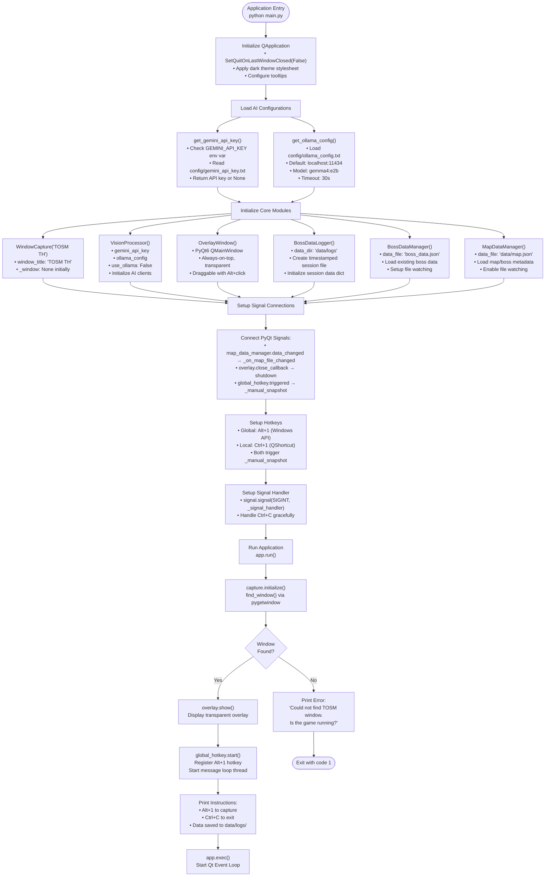

---

## 2. Detailed Application Workflow

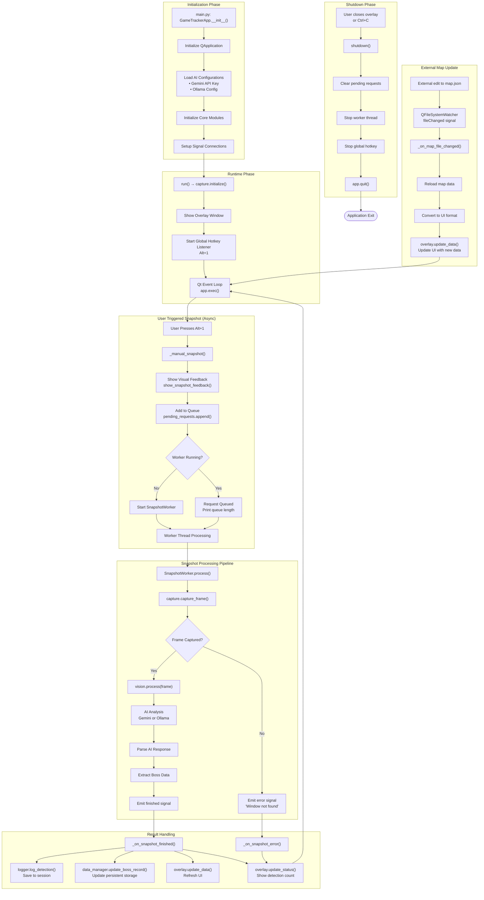

---

## 3. Async Snapshot Processing

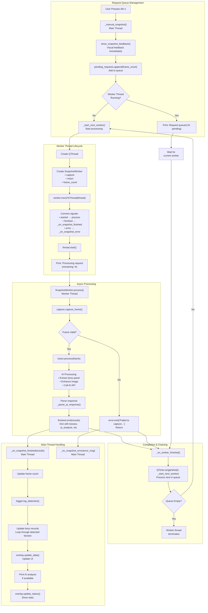

---

## 4. AI Provider Selection & Initialization

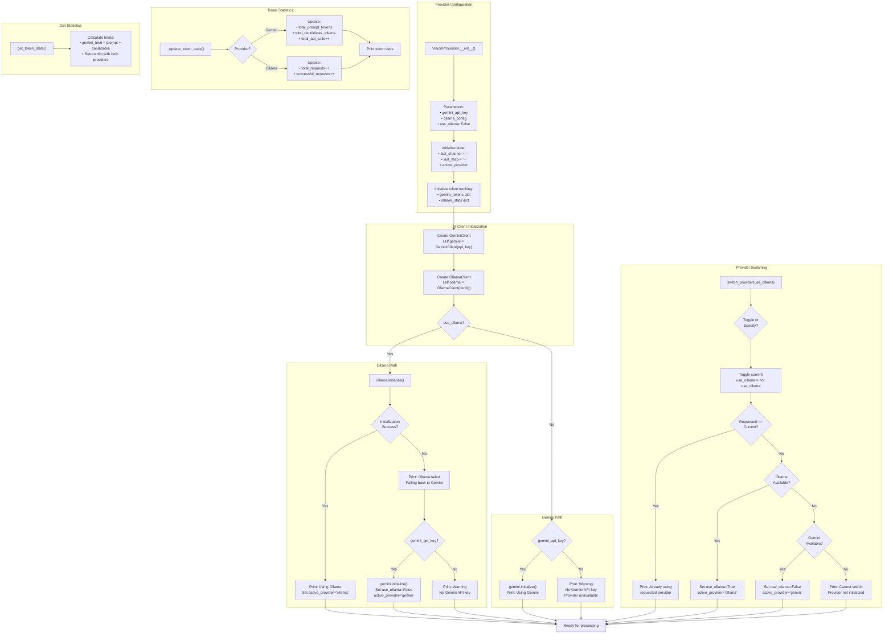

---

## 5. Window Capture Process

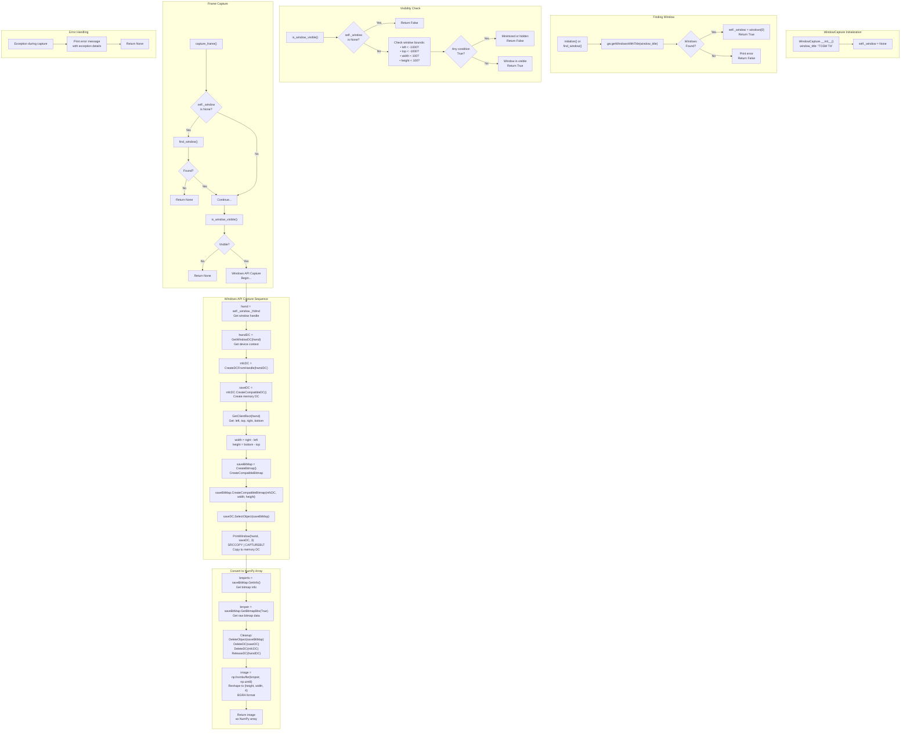

---

## 6. Vision Processing Pipeline

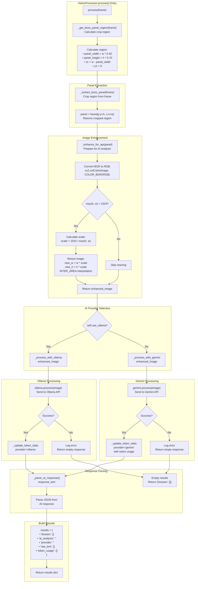

---

## 7. AI Response Parsing

```mermaid
flowchart TD
    subgraph "Parse Entry"
        A["_parse_ai_response(response, provider)"] --> B{response is None<br/>or empty?}
        B -->|Yes| C["Print: Empty response<br/>Return []"]
        B -->|No| D["Strip whitespace<br/>response = response.strip()"]
        D --> E{Empty after strip?}
        E -->|Yes| F["Print: Empty after strip<br/>Return []"]
        E -->|No| G["Log preview:<br/>first 100 chars<br/>Preview: 'xxx...'"]
    end
    
    subgraph "Error Detection"
        G --> H{Response starts with<br/>'API error'?}
        H -->|Yes| I["Print: API error detected<br/>Return []"]
        H -->|No| J{"Contains<br/>'quota exceeded'?"}
        J -->|Yes| K["Print: Quota exceeded<br/>Return []"]
        J -->|No| L["Continue to<br/>content extraction"]
    end
    
    subgraph "Extract JSON from Markdown"
        L --> M{"Contains<br/>'```json'?"}
        M -->|Yes| N["Extract from<br/>```json block<br/>Find start/end<br/>Strip markdown"]
        M -->|No| O{"Contains<br/>'```'?"}
        O -->|Yes| P["Extract from<br/>generic code block"]
        O -->|No| Q["No markdown<br/>blocks found"]
        N --> R["Continue"]
        P --> R
        Q --> R
    end
    
    subgraph "Regex Extraction Fallback"
        R --> S{response starts<br/>with '{'?}
        S -->|Yes| T["Already JSON<br/>Continue to parse"]
        S -->|No| U["re.search(r'\{[\s\S]*\}', response)<br/>Find JSON with regex"]
        U --> V{Match found?}
        V -->|Yes| W{"Match is valid<br/>JSON (>10 chars,<br/>starts with '{')?"}
        W -->|Yes| X["response = match.group(0)<br/>Log extracted JSON"]
        W -->|No| Y["Print: Not valid JSON<br/>Return []"]
        V -->|No| Z["Print: No JSON found<br/>Return []"]
    end
    
    subgraph "Final Validation"
        X --> AA{"response length<br/>> 2?"}
        AA -->|No| AB["Print: Too short<br/>Return []"]
        AA -->|Yes| AC{"response starts<br/>with '{'?"}
        AC -->|No| AD["Print: Doesn't start with {<br/>Return []"]
        AC -->|Yes| AE["Continue to parsing"]
    end
    
    subgraph "JSON Parsing"
        AE --> AF["json.loads(response)<br/>Parse JSON"]
        AF --> AG{"Parse<br/>Success?"}
        AG -->|Yes| AH["Print: JSON parsed<br/>successfully"]
        AG -->|No| AI["Print: JSON parse error<br/>Return []"]
    end
    
    subgraph "Format Detection & Processing"
        AH --> AJ{"'boss_name'<br/>in data?"}
        AJ -->|Yes| AK["New format detected<br/>Process single boss object"]
        AJ -->|No| AL{"'bosses'<br/>in data?"}
        AL -->|Yes| AM["Old format detected<br/>Process bosses array"]
        AL -->|No| AN["Unknown format<br/>Return []"]
    end
    
    subgraph "New Format Processing"
        AK --> AO["Extract fields:<br/>• boss_name<br/>• boss_type<br/>• channel<br/>• current_status<br/>• time_until_spawn"]
        AO --> AP["get_boss_info(boss_name)<br/>Lookup map, lv, type"]
        AP --> AQ{"current_status<br/>== 'WAITING_FOR_SPAWN'?"}
        AQ -->|Yes| AR["status = 'N'<br/>countdown = time field"]
        AQ -->|No| AS{"current_status<br/>starts with 'LV_'?"}
        AS -->|Yes| AT["Extract level number<br/>status = 'LV{N}'"]
        AS -->|No| AU["Default status = 'N'"]
        AR --> AV["Build boss dict"]
        AT --> AV
        AU --> AV
    end
    
    subgraph "Build Boss Record"
        AV --> AW["boss = {<br/>• name<br/>• map (from lookup)<br/>• channel<br/>• countdown<br/>• status<br/>• type<br/>• level<br/>• note<br/>}"]
        AW --> AX["bosses.append(boss)"]
        AX --> AY["Return bosses list"]
    end
    
    C --> END(["Return []"])
    F --> END
    I --> END
    K --> END
    Y --> END
    Z --> END
    AB --> END
    AD --> END
    AI --> END
    AN --> END
    AY --> END
```

---

## 8. Data Manager Operations

```mermaid
flowchart TD
    subgraph "BossDataManager Initialization"
        A["BossDataManager.__init__()<br/>data_file='boss_data.json'"] --> B["Initialize:<br/>• boss_data: {}<br/>• _file_watcher<br/>• _watching_enabled=False"]
        B --> C["load_data()<br/>Load from JSON file"]
        C --> D["_setup_file_watching()<br/>Setup QFileSystemWatcher"]
    end
    
    subgraph "Load Data"
        D --> E{"data_file<br/>exists?"}
        E -->|No| F["Create new file<br/>boss_data = {}<br/>save_data()<br/>enable_file_watching()"]
        E -->|Yes| G["open(data_file, 'r')<br/>Read JSON"]
        G --> H["boss_data = json.load(f)"]
        H --> I["Print: Loaded N<br/>bosses from file"]
        H --> J["JSONDecodeError?"]
        J -->|Yes| K["Print: Error reading<br/>Create new file"]
        K --> L["boss_data = {}<br/>save_data()"]
    end
    
    subgraph "Update Boss Record"
        M["update_boss_record(<br/>boss_name, map_name,<br/>channel, time_left_str,<br/>status, boss_type)"] --> N{"boss_name in<br/>boss_data?"}
        N -->|No| O["Create new entry:<br/>boss_data[boss_name] = {<br/>• name<br/>• first_seen<br/>• last_updated<br/>• spawn_count: 0<br/>• locations: {}<br/>}"]
        N -->|Yes| P["Get existing entry"]
        O --> Q["Set first_seen = now()"]
        P --> R["Update last_updated = now()"]
        Q --> R
        R --> S{"location_key in<br/>locations?"}<br/>location_key = "{map}_{channel}"
        S -->|No| T["Create location:<br/>locations[loc_key] = {<br/>• map<br/>• channel<br/>• spawn_history: []<br/>}"]
        S -->|Yes| U["Get existing location"]
        T --> V["spawn_count += 1"]
        U --> V
    end
    
    subgraph "Spawn History Management"
        V --> W["Calculate spawn_time:<br/>now() + time_left_str"]
        W --> X["Create history entry:<br/>• detected_at<br/>• time_left<br/>• spawn_time"]
        X --> Y["Add to spawn_history<br/>at position 0 (newest)"]
        Y --> Z{"spawn_history<br/>length > 10?"}
        Z -->|Yes| AA["Remove oldest entry<br/>Keep only 10 records"]
        Z -->|No| AB["Keep as is"]
        AA --> AC["save_data()<br/>Persist to JSON"]
        AB --> AC
    end
    
    subgraph "Save Data (Atomic)"
        AC --> AD["save_data()"] --> AE{"data_file<br/>exists?"}
        AE -->|Yes| AF["Create backup:<br/>shutil.copy2(data_file,<br/>data_file.bak)"]
        AE -->|No| AG["Skip backup"]
        AF --> AH["Write to temp file:<br/>data_file.tmp"]
        AG --> AH
        AH --> AI["json.dump(boss_data, f,<br/>indent=2, ensure_ascii=False)"]
        AI --> AJ["Atomic replace:<br/>temp_file.replace(data_file)"]
        AJ --> AK{"Success?"}
        AK -->|Yes| AL["Return True"]
        AK -->|No| AM["Print error<br/>Return False"]
    end
    
    subgraph "File Watching"
        AN["_setup_file_watching()"] --> AO{"data_file<br/>exists?"}
        AO -->|Yes| AP["_file_watcher.addPath(data_file)"]
        AP --> AQ["Connect signal:<br/>fileChanged → _on_file_changed"]
        AQ --> AR["_watching_enabled = True"]
        AO -->|No| AS["Print: File not found<br/>Will watch when created"]
    end
    
    subgraph "External File Change"
        AT["External edit to file"] --> AU["QFileSystemWatcher<br/>fileChanged signal"]
        AU --> AV["_on_file_changed(path)"]
        AV --> AW{"_watching_enabled?"}
        AW -->|Yes| AX["QTimer.singleShot(100ms,<br/>_reload_and_notify)"]
        AW -->|No| AY["Ignore (disabled)"]
        AX --> AZ["_reload_and_notify()"]
        AZ --> BA["old_data = map_data.copy()"]
        BA --> BB["load_data()"]
        BB --> BC{"old_data !=<br/>map_data?"}
        BC -->|Yes| BD["data_changed.emit(map_data)<br/>Notify listeners"]
        BC -->|No| BE["No change detected"]
    end
```

---

## 9. File Watching & Real-time Sync

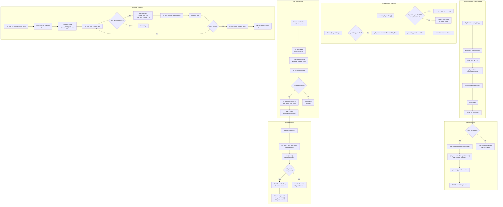

---

## 10. UI Component Architecture

```mermaid
flowchart TD
    subgraph "OverlayWindow Hierarchy"
        A["OverlayWindow<br/>(QMainWindow)"] --> B["Central Widget<br/>QWidget"]
        
        B --> C["Main Layout<br/>QVBoxLayout<br/>setContentsMargins(12, 12, 12, 12)"]
        
        C --> D["Title Bar<br/>QHBoxLayout"]
        D --> D1["Title Label<br/>'🎮 TOSM Boss Tracker'"]
        D --> D2["Drag Handle<br/>'⋮⋮' (grip indicator)"]
        D --> D3["Control Buttons<br/>Minimize | Pin | Close"]
        
        C --> E["Filter Section<br/>QHBoxLayout"]
        E --> E1["Filter Input<br/>QLineEdit<br/>Placeholder: 'Filter by map...'"]
        E --> E2["Map Level Filter<br/>Dropdown"]
        E --> E3["Clear Filter<br/>QPushButton"]
        
        C --> F["Table Header<br/>QHBoxLayout"]
        F --> F1["SortableHeaderButton<br/>'BOSS' (210px)"]
        F --> F2["SortableHeaderButton<br/>'TYPE' (80px)"]
        F --> F3["SortableHeaderButton<br/>'MAP' (150px)"]
        F --> F4["SortableHeaderButton<br/>'CH' (50px)"]
        F --> F5["SortableHeaderButton<br/>'STATUS' (80px)"]
        F --> F6["SortableHeaderButton<br/>'TIME' (80px, right)"]
        F --> F7["SortableHeaderButton<br/>'LV' (50px, right)"]
        
        C --> G["Boss Data Container<br/>QVBoxLayout"]
        G --> G1["BossRow Widgets<br/>(Dynamic list)"]
        
        C --> H["Status Bar<br/>QHBoxLayout"]
        H --> H1["Status Label<br/>'Ready' | 'Detected N boss(es)'"]
        H --> H2["Size Grip<br/>QSizeGrip"]
    end
    
    subgraph "BossRow Component"
        I["BossRow<br/>(QFrame)"] --> J["Horizontal Layout"]
        
        J --> K["Boss Name<br/>QLabel (210px)"]
        K --> K1["Font: Segoe UI 11<br/>Color: #F8FAFC"]
        K --> K2["Map lookup tooltip<br/>on hover"]
        
        J --> L["Type Badge<br/>QLabel (80px)"]
        L --> L1["Background by type:<br/>• Demon: #EF4444<br/>• Beast: #A855F7<br/>• Plant: #22C55E<br/>• etc."]
        
        J --> M["Map Name<br/>QLabel (150px)"]
        M --> M1["Font: Segoe UI 10<br/>Color: #94A3B8"]
        
        J --> N["Channel<br/>QLabel (50px)"]
        N --> N1["'CH.1', 'CH.2', etc."]
        
        J --> O["Status Badge<br/>QFrame (80px)"]
        O --> O1["Styles:<br/>• N: Neutral<br/>• LV1-LV4: Activity levels<br/>Colors indicate urgency"]
        
        J --> P["Time Left<br/>QLabel (80px, right)"]
        P --> P1["Font: Segoe UI 10<br/>Color: #FBBF24 (gold)"]
        P --> P2["Format: HH:MM:SS"]
        
        J --> Q["Level Badge<br/>QLabel (50px, right)"]
        Q --> Q1["Format: '430+'"]
        Q --> Q2["Font: Segoe UI 9<br/>Bold weight"]
        
        I --> R["Hover Effects<br/>setStyleSheet on<br/>enter/leave events"]
        I --> S["Context Menu<br/>Right-click actions"]
    end
    
    subgraph "SortableHeaderButton"
        T["SortableHeaderButton<br/>(QPushButton)"] --> U["Properties:<br/>• _column: str<br/>• _sort_direction: None/'asc'/'desc'<br/>• _width: int<br/>• _align_right: bool"]
        
        U --> V["Signals:<br/>clicked.emit(str)<br/>Emits column name"]
        
        U --> W["Methods:<br/>• _update_style()<br/>• set_sort_direction()<br/>• reset_sort()"]
        
        W --> X["Style States:<br/>• Active sort: Purple gradient<br/>• Inactive: Transparent<br/>Arrow indicators: ▲ ▼"]
        
        T --> Y["Click Handler<br/>Connected from OverlayWindow<br/>Calls _on_header_clicked()"]
    end
    
    subgraph "Window Properties"
        Z["OverlayWindow<br/>Window Attributes"] --> AA["Window Flags:<br/>• Qt.WindowType.Window<br/>• Qt.WindowType.WindowStaysOnTopHint<br/>• Qt.WindowType.FramelessWindowHint<br/>• Qt.WindowType.WindowTransparentForInput (optional)"]
        
        AA --> AB["Attribute:<br/>Qt.WidgetAttribute.WA_TranslucentBackground"]
        
        AB --> AC["StyleSheet:<br/>• Background: rgba(15, 23, 42, 0.85)<br/>• Border-radius: 12px<br/>• Border: 1px solid rgba(139, 92, 246, 0.3)"]
        
        AC --> AD["Geometry:<br/>• Default size: 900x500<br/>• Restored from ui_state.json<br/>• Position: saved/loaded"]
    end
```

---

## 11. UI State Management

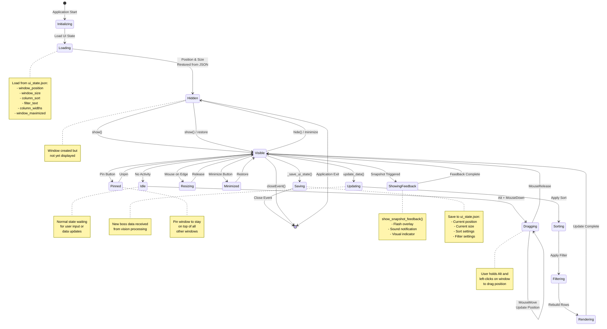

---

## 12. User Interaction Flow

```mermaid
sequenceDiagram
    participant User
    participant Overlay as OverlayWindow
    participant DataMgr as BossDataManager
    participant MapMgr as MapDataManager
    participant File as JSON Files
    participant Logger as BossDataLogger
    
    rect rgb(40, 40, 50)
        Note over User,Logger: Initialization Phase
        User->>Overlay: Start Application
        Overlay->>DataMgr: Load boss_data.json
        Overlay->>MapMgr: Load map.json
        Overlay->>Overlay: Restore UI state<br/>position, size, filters
    end
    
    rect rgb(30, 50, 40)
        Note over User,Logger: Normal Operation - Snapshot
        User->>Overlay: Press Alt+1 (Global Hotkey)
        Overlay->>Overlay: show_snapshot_feedback()<br/>Visual feedback
        
        par Async Processing
            Overlay->>Overlay: Queue snapshot request
        and Worker Thread
            Overlay->>Overlay: Capture game window
            Overlay->>Overlay: AI vision processing
            Overlay->>Overlay: Parse boss data
        end
        
        Overlay->>DataMgr: update_boss_record()<br/>For each detected boss
        DataMgr->>DataMgr: Update spawn history
        DataMgr->>File: Save boss_data.json<br/>(atomic write with backup)
        DataMgr-->>Overlay: emit data_changed
        
        Overlay->>Logger: log_detection()<br/>Save to session file
        
        Overlay->>Overlay: update_data()<br/>Refresh UI
        Overlay->>User: Display updated boss list
    end
    
    rect rgb(50, 40, 30)
        Note over User,Logger: Dragging Window
        User->>Overlay: Hold Alt + MouseDown
        Overlay->>Overlay: Set _is_dragging = True
        Overlay->>Overlay: Store drag start position
        
        loop Mouse Movement
            User->>Overlay: MouseMove
            Overlay->>Overlay: Calculate delta<br/>Update window position
        end
        
        User->>Overlay: MouseRelease
        Overlay->>Overlay: _is_dragging = False
        Overlay->>Overlay: _save_ui_state()<br/>Persist new position
    end
    
    rect rgb(50, 50, 30)
        Note over User,Logger: External File Edit
        User->>File: Edit map.json<br/>(external editor)
        File->>MapMgr: QFileSystemWatcher<br/>fileChanged signal
        MapMgr->>MapMgr: _on_file_changed()
        MapMgr->>File: Reload map.json
        MapMgr-->>Overlay: emit data_changed(map_data)
        Overlay->>Overlay: _on_map_file_changed()
        Overlay->>Overlay: Convert map data to UI format
        Overlay->>Overlay: update_data()<br/>Refresh display
        Overlay->>User: Show 'Map data refreshed' status
    end
    
    rect rgb(50, 30, 30)
        Note over User,Logger: Sorting & Filtering
        User->>Overlay: Click column header
        Overlay->>Overlay: _on_header_clicked(column)
        Overlay->>Overlay: Toggle sort direction<br/>asc → desc → none
        Overlay->>Overlay: _sort_bosses()
        Overlay->>Overlay: Rebuild UI rows
        Overlay->>User: Display sorted data
        
        User->>Overlay: Type in filter box
        Overlay->>Overlay: _filter_text_changed(text)
        Overlay->>Overlay: _apply_filter()
        Overlay->>Overlay: Filter bosses by map/name
        Overlay->>Overlay: _rebuild_boss_list()
        Overlay->>User: Display filtered results
    end
    
    rect rgb(30, 30, 50)
        Note over User,Logger: Shutdown
        User->>Overlay: Close window or Ctrl+C
        Overlay->>Overlay: closeEvent()
        Overlay->>Overlay: _save_ui_state()
        Overlay->>File: Write ui_state.json
        Overlay->>DataMgr: Cleanup
        Overlay->>MapMgr: Disable file watching
        Overlay->>Logger: save()<br/>Export session report
        Overlay-->>User: Application exits
    end
```

---

## 13. Global Hotkey Handling

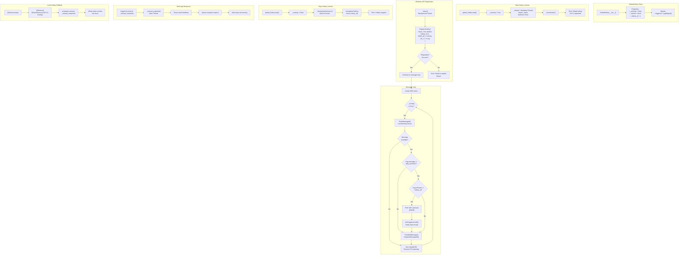

---

## 14. Session Logging

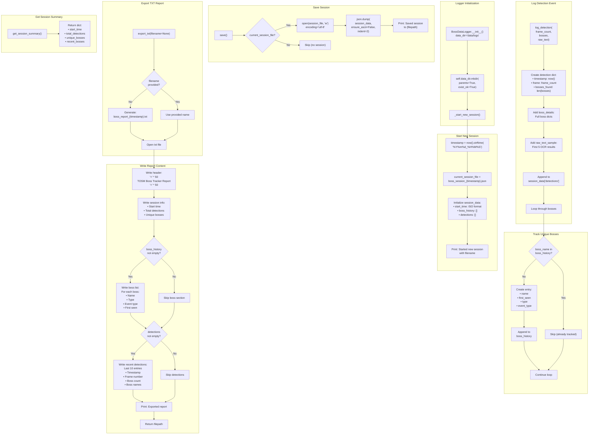

---

## 15. Error Handling Workflow

```mermaid
flowchart TD
    subgraph "Error Classification"
        A["Exception Occurs"] --> B{Error Type}
        
        B -->|WindowCapture| C["Window Capture Errors:<br/>• Window not found<br/>• Window minimized<br/>• Windows API failure<br/>• Access denied"]
        
        B -->|VisionProcessing| D["Vision Processing Errors:<br/>• Gemini API error<br/>• Ollama connection failed<br/>• Rate limit exceeded<br/>• Quota exceeded<br/>• Invalid response format"]
        
        B -->|DataParsing| E["Data Parsing Errors:<br/>• JSON decode error<br/>• Missing required fields<br/>• Invalid boss name<br/>• Time format error"]
        
        B -->|FileIO| F["File I/O Errors:<br/>• Permission denied<br/>• Disk full<br/>• File locked<br/>• Corrupted JSON<br/>• Backup failure"]
        
        B -->|UI| G["UI Errors:<br/>• Qt widget error<br/>• StyleSheet parse error<br/>• Signal connection failed<br/>• Thread access violation"]
        
        B -->|Network| H["Network Errors:<br/>• Connection timeout<br/>• DNS resolution failed<br/>• SSL certificate error<br/>• Proxy error"]
    end
    
    subgraph "Window Capture Recovery"
        C --> C1["find_window()<br/>Retry detection"] --> C2{Window<br/>Found?}
        C2 -->|Yes| C3["Continue normally"]
        C2 -->|No| C4{"Retry count <<br/>max_retries?"}
        C4 -->|Yes| C5["Wait 2 seconds"] --> C1
        C4 -->|No| C6["Emit error signal:<br/>'Window not found'"] --> C7["Update status:<br/>'Check if game is running'"]
    end
    
    subgraph "AI Provider Recovery"
        D --> D1{Provider}
        D1 -->|Gemini| D2{"Error Type?"}
        D2 -->|Quota| D3["Print: 'Quota exceeded'"] --> D4["Try Ollama fallback<br/>if available"]
        D2 -->|Rate Limit| D5["Wait 5 seconds"] --> D6["Retry with backoff"]
        D2 -->|Auth| D7["Print: 'Invalid API key'"] --> D8["Disable Gemini<br/>Use Ollama only"]
        D2 -->|Network| D9["Retry 3 times"] --> D10{"Success?"}
        D10 -->|Yes| D11["Continue"]
        D10 -->|No| D4
        
        D1 -->|Ollama| D12{"Error Type?"}
        D12 -->|Connection| D13["Print: 'Ollama not running'"] --> D14["Check localhost:11434"]
        D12 -->|Timeout| D15["Increase timeout"] --> D16["Retry once"]
        D12 -->|Model| D17["Print: 'Model not found'"] --> D18["Suggest model pull"]
    end
    
    subgraph "Data Parsing Recovery"
        E --> E1{Error Type}
        E1 -->|JSON| E2["Print: 'Invalid JSON'"] --> E3["Try regex extraction"] --> E4{"Extracted<br/>valid JSON?"}
        E4 -->|Yes| E5["Continue with extracted"]
        E4 -->|No| E6["Log raw response<br/>for debugging"] --> E7["Return empty result"]
        
        E1 -->|Missing Fields| E8["Apply defaults:<br/>• name: 'Unknown'<br/>• map: '--'<br/>• status: 'N'"]
        E8 --> E9["Continue with defaults"]
        
        E1 -->|Time Format| E10["Try alternative parsers:<br/>• HH:MM:SS<br/>• HH:MM<br/>• Minutes only"]
        E10 --> E11{"Parse<br/>Success?"}
        E11 -->|Yes| E12["Use parsed value"]
        E11 -->|No| E13["Set countdown: ''<br/>status: 'N'"]
    end
    
    subgraph "File I/O Recovery"
        F --> F1{Error Type}
        F1 -->|Permission| F2["Try alternative path:<br/>• User home dir<br/>• Temp directory"]
        F2 --> F3{"Write<br/>Success?"}
        F3 -->|Yes| F4["Continue with new path"]
        F3 -->|No| F5["Print: 'Cannot write file'"] --> F6["Continue without saving"]
        
        F1 -->|Corrupted| F7["Load backup file:<br/>data_file.bak"]
        F7 --> F8{"Backup<br/>exists?"}
        F8 -->|Yes| F9["Restore from backup"]
        F8 -->|No| F10["Create new empty file"]
        
        F1 -->|Locked| F11["Wait 500ms"] --> F12["Retry write"] --> F13{"Success?"}
        F13 -->|Yes| F14["Continue"]
        F13 -->|No| F15["Skip this save<br/>Will retry next time"]
    end
    
    subgraph "Graceful Degradation"
        AllErrors["All Error Types"] --> RetryLogic{"Can<br/>Recover?"}
        RetryLogic -->|Yes| Recovery["Apply Recovery<br/>Action"]
        RetryLogic -->|No| Degrade["Graceful Degradation:<br/>• Disable feature<br/>• Use fallback<br/>• Inform user"]
        
        Recovery --> Monitor["Monitor for<br/>recurrence"]
        Degrade --> Monitor
        
        Monitor --> Log["Log error details:<br/>• Timestamp<br/>• Stack trace<br/>• Context<br/>• Recovery action"]
        
        Log --> Continue["Continue operation<br/>with reduced functionality<br/>if needed"]
    end
```

---

## 16. Graceful Shutdown Sequence

```mermaid
flowchart TD
    subgraph "Shutdown Triggers"
        A["Shutdown Initiated"] --> B{Trigger Source}
        B -->|User| C["Close button click<br/>on overlay window"]
        B -->|Signal| D["Ctrl+C pressed<br/>SIGINT received"]
        B -->|Error| E["Critical error<br/>requires restart"]
        B -->|System| F["Windows logout<br/>System shutdown"]
    end
    
    subgraph "Shutdown Entry"
        C --> G["_on_overlay_closed()"]
        D --> G
        E --> G
        F --> G
        G --> H["shutdown()<br/>Main method"]
    end
    
    subgraph "Shutdown Check"
        H --> I{"_shutdown_called?"}
        I -->|Yes| J["Already shutting down<br/>Return immediately"]
        I -->|No| K["_shutdown_called = True<br/>Prevent re-entry"]
    end
    
    subgraph "Phase 1: Stop Data Collection"
        K --> L["Print: 'Shutting down...'"]
        L --> M["Clear pending_requests<br/>Cancel queued snapshots"]
        M --> N{"Queue had<br/>items?"}
        N -->|Yes| O["Print: 'Cancelling N<br/>pending requests'"]
        N -->|No| P["Continue"]
    end
    
    subgraph "Phase 2: Stop Worker Thread"
        O --> Q
        P --> Q["Stop async worker:"]
        Q --> Q1["if worker_thread.isRunning():"]
        Q1 --> Q2["worker_thread.quit()<br/>Request termination"]
        Q2 --> Q3["worker_thread.wait()<br/>Wait for completion"]
    end
    
    subgraph "Phase 3: Stop Hotkey Listener"
        Q3 --> R["Stop global hotkey:<br/>global_hotkey.stop()"]
        R --> R1["Set _running = False"]
        R1 --> R2["UnregisterHotKey()<br/>Windows API"]
        R2 --> R3["Thread join with<br/>1 second timeout"]
    end
    
    subgraph "Phase 4: Disable File Watching"
        R3 --> S["Disable file watching:<br/>map_data_manager.disable_file_watching()"]
        S --> S1["Remove watcher paths"]
        S1 --> S2["_watching_enabled = False"]
    end
    
    subgraph "Phase 5: Save Final State"
        S2 --> T["UI State:<br/>overlay._save_ui_state()<br/>(if not already saved)"]
        
        T --> U{"Boss data<br/>changed?"}
        U -->|Yes| V["data_manager.save_data()<br/>Persist to JSON"]
        U -->|No| W["Skip boss data save"]
        
        V --> X["Session Logging:<br/>logger.save()"]
        W --> X
        
        X --> Y{"Session has<br/>detections?"}
        Y -->|Yes| Z["logger.export_txt()<br/>Generate human-readable report"]
        Y -->|No| AA["Skip report generation"]
        Z --> AB["Print: Report saved to<br/>{filepath}"]
    end
    
    subgraph "Phase 6: Resource Cleanup"
        AB --> AC
        AA --> AC["Resource cleanup:"]
        AC --> AC1["Release window handles"]
        AC1 --> AC2["Close file descriptors"]
        AC2 --> AC3["Free Qt resources"]
        AC3 --> AC4["Clear caches"]
    end
    
    subgraph "Phase 7: Exit Application"
        AC4 --> AD["app.quit()<br/>Exit Qt event loop"]
        AD --> AE["Print: 'Shutdown complete'"]
        AE --> AF(["Process Exit<br/>Return to OS"])
    end
    
    J --> AF
```

---

## 17. Module Interaction Diagram

```mermaid
graph TB
    subgraph "Entry Point"
        MAIN["main.py<br/>GameTrackerApp"]
    end
    
    subgraph "Core Processing Modules"
        CAPTURE["core/capture.py<br/>WindowCapture"]
        VISION["core/vision.py<br/>VisionProcessor"]
        AI_GEMINI["GeminiClient"]
        AI_OLLAMA["OllamaClient"]
    end
    
    subgraph "Data Management"
        DATA_MGR["core/data_manager.py<br/>BossDataManager"]
        MAP_MGR["core/data_manager.py<br/>MapDataManager"]
        LOGGER["core/logger.py<br/>BossDataLogger"]
        MAP_LEVEL["core/map_level.py<br/>Map/Boss Info"]
    end
    
    subgraph "User Interface"
        UI["core/ui.py<br/>OverlayWindow"]
        UI_COMP["UI Components:<br/>• BossRow<br/>• SortableHeaderButton<br/>• Filter Controls"]
    end
    
    subgraph "Utility"
        UTILS["utils/find_window.py<br/>Window Detection"]
    end
    
    subgraph "Data Files"
        BOSS_DATA[("boss_data.json<br/>Persistent boss records")]
        UI_STATE[("ui_state.json<br/>Window position,<br/>filters, sort")]
        MAP_JSON[("data/map.json<br/>Boss metadata")]
        SESSION_LOG[("data/logs/<br/>Session files")]
        CONFIG[("config/<br/>• gemini_api_key.txt<br/>• ollama_config.json")]
    end
    
    %% Main orchestration
    MAIN -->|initializes| CAPTURE
    MAIN -->|initializes| VISION
    MAIN -->|initializes| UI
    MAIN -->|initializes| DATA_MGR
    MAIN -->|initializes| MAP_MGR
    MAIN -->|initializes| LOGGER
    
    %% Vision processing
    MAIN -->|triggers| SNAPSHOT["SnapshotWorker<br/>(QThread)"]
    SNAPSHOT -->|calls| CAPTURE
    SNAPSHOT -->|calls| VISION
    CAPTURE -->|returns frame| VISION
    VISION -->|uses| AI_GEMINI
    VISION -->|uses| AI_OLLAMA
    VISION -->|looks up| MAP_LEVEL
    
    %% Data flow
    VISION -->|parsed results| MAIN
    MAIN -->|boss records| DATA_MGR
    MAIN -->|detection events| LOGGER
    MAIN -->|display data| UI
    
    %% Data manager operations
    DATA_MGR -->|reads/writes| BOSS_DATA
    MAP_MGR -->|reads/watches| MAP_JSON
    DATA_MGR -->|signals| MAIN
    MAP_MGR -->|signals| MAIN
    
    %% Logger
    LOGGER -->|writes| SESSION_LOG
    
    %% UI operations
    UI -->|loads/saves| UI_STATE
    UI -->|requests update| DATA_MGR
    UI -->|triggers| MAIN
    
    %% UI components
    UI -->|contains| UI_COMP
    UI_COMP -->|interacts| UI
    
    %% Map level
    MAP_LEVEL -->|reads| MAP_JSON
    VISION -->|queries| MAP_LEVEL
    
    %% Utilities
    CAPTURE -.->|uses| UTILS
    
    %% Configuration
    AI_GEMINI -.->|reads| CONFIG
    AI_OLLAMA -.->|reads| CONFIG
    
    %% File watching signals
    MAP_MGR -.->|data_changed| MAIN
    DATA_MGR -.->|data_changed| MAIN
    
    %% Hotkey
    MAIN -->|manages| HOTKEY["GlobalHotkey<br/>(Windows API)"]
    HOTKEY -->|signals| MAIN
    
    style MAIN fill:#4A5568,stroke:#F7FAFC,stroke-width:3px
    style UI fill:#2D3748,stroke:#63B3ED,stroke-width:2px
    style VISION fill:#2D3748,stroke:#9F7AEA,stroke-width:2px
    style DATA_MGR fill:#2D3748,stroke:#68D391,stroke-width:2px
```

---

## 18. Data Persistence Architecture

```mermaid
flowchart TD
    subgraph "Data Types"
        A["Application Data"] --> B["Boss Tracking Data<br/>Historical records"]
        A --> C["Session Data<br/>Temporary logs"]
        A --> D["UI State Data<br/>User preferences"]
        A --> E["Configuration Data<br/>API keys, settings"]
        A --> F["Map Metadata<br/>Boss information"]
    end
    
    subgraph "Storage Strategy"
        B --> B1["boss_data.json<br/>Persistent JSON storage"]
        B1 --> B2["Structure:<br/>• boss_name (key)<br/>• first_seen<br/>• last_updated<br/>• spawn_count<br/>• locations (dict)"]
        B2 --> B3["Location format:<br/>'{map}_{channel}'<br/>• map<br/>• channel<br/>• spawn_history[]"]
        B3 --> B4["History entry:<br/>• detected_at<br/>• time_left<br/>• spawn_time"]
        B4 --> B5["Max 10 records<br/>per location<br/>FIFO eviction"]
    end
    
    subgraph "Atomic Write Pattern"
        C1["Save Operation"] --> C2["1. Create backup:<br/>shutil.copy2(src, src.bak)"]
        C2 --> C3["2. Write to temp:<br/>file.json.tmp"]
        C3 --> C4["3. json.dump(data, f,<br/>indent=2,<br/>ensure_ascii=False)"]
        C4 --> C5["4. Atomic replace:<br/>temp.replace(original)"]
        C5 --> C6{"Success?"}
        C6 -->|Yes| C7["Return True"]
        C6 -->|No| C8["Return False<br/>Backup preserved"]
    end
    
    subgraph "Session Logging"
        D1["Session File:<br/>boss_session_YYYYMMDD_HHMMSS.json"] --> D2["Structure:<br/>• start_time<br/>• boss_history[]<br/>• detections[]"]
        D2 --> D3["Detection entry:<br/>• timestamp<br/>• frame<br/>• bosses_found<br/>• boss_details[]<br/>• raw_text_sample"]
        D3 --> D4["Auto-save on<br/>shutdown or<br/>periodic"]
    end
    
    subgraph "UI State Persistence"
        E1["ui_state.json"] --> E2["Saved on:<br/>• Window move<br/>• Window resize<br/>• Sort change<br/>• Filter change<br/>• Close"]
        E2 --> E3["Structure:<br/>• window_position [x, y]<br/>• window_size [w, h]<br/>• column_sort {col, dir}<br/>• filter_text<br/>• column_widths<br/>• window_maximized"]
    end
    
    subgraph "File Watching"
        F1["QFileSystemWatcher<br/>Setup"] --> F2["Watch:<br/>• data/map.json<br/>• boss_data.json"]
        F2 --> F3["Signals:<br/>fileChanged(path)"]
        F3 --> F4["Handler:<br/>_on_file_changed()"]
        F4 --> F5["Debounce:<br/>QTimer.singleShot(100ms)"]
        F5 --> F6["Compare old vs new<br/>Emit if changed"]
    end
    
    subgraph "Backup Strategy"
        G1["Automatic Backups"] --> G2["On every save:<br/>• .json → .json.bak"]
        G2 --> G3["Recovery:<br/>If .json corrupted,<br/>restore from .bak"]
        G3 --> G4["Graceful degradation:<br/>If both fail,<br/>create new empty"]
    end
```

---

## 19. Configuration Management

```mermaid
flowchart TD
    subgraph "Configuration Sources"
        A["Configuration Loading"] --> B["Priority Order:<br/>1. Environment Variables<br/>2. Config Files<br/>3. Default Values"]
        
        B --> C["Environment Variables:<br/>• GEMINI_API_KEY<br/>• USE_OLLAMA (true/false)"]
        
        B --> D["Config Files:<br/>• config/gemini_api_key.txt<br/>• config/ollama_config.json"]
        
        B --> E["Default Values:<br/>• Ollama: localhost:11434<br/>• Model: gemma4:e2b<br/>• Timeout: 30s"]
    end
    
    subgraph "Gemini API Key Loading"
        F["get_gemini_api_key()"] --> G{"GEMINI_API_KEY<br/>in environ?"}
        G -->|Yes| H["Return env value<br/>Print: 'Using from env'"]
        G -->|No| I["Check:<br/>config/gemini_api_key.txt"]
        I --> J{"File exists?"}
        J -->|Yes| K["Read file<br/>Strip whitespace"]
        K --> L{Content<br/>not empty?}
        L -->|Yes| M["Return key<br/>Print: 'Using from file'"]
        L -->|No| N["Print: 'No API key found'"]
        J -->|No| N
        N --> O["Return None<br/>Gemini disabled"]
    end
    
    subgraph "Ollama Config Loading"
        P["get_ollama_config()"] --> Q["default_config = {<br/>endpoint: 'http://localhost:11434',<br/>model: 'gemma4:e2b',<br/>timeout: 30}"]
        Q --> R{"config/ollama_config.json<br/>exists?"}
        R -->|Yes| S["json.load(config_file)"]
        S --> T["Merge with defaults:<br/>{**default, **loaded}"]
        T --> U["Print: 'Using config from file'"]
        R -->|No| V["Use defaults only<br/>Print: 'Using default config'"]
    end
    
    subgraph "Provider Preference"
        W["get_ai_provider_preference()"] --> X{"USE_OLLAMA<br/>in environ?"}
        X -->|Yes| Y{"Value in<br/>('true', '1', 'yes')?"}
        Y -->|Yes| Z["Return True<br/>Use Ollama"]
        Y -->|No| AA["Return False<br/>Use Gemini"]
        X -->|No| AB["Default: Ollama<br/>(current setting)"]
    end
    
    subgraph "Configuration Validation"
        AC["Validate Configurations"] --> AD{"Gemini API key<br/>valid?"}
        AD -->|Yes| AE["Initialize Gemini client"]
        AD -->|No| AF["Mark Gemini<br/>unavailable"]
        
        AE --> AG{"Ollama reachable?"}
        AF --> AG
        AG -->|Yes| AH["Initialize Ollama client"]
        AG -->|No| AI["Mark Ollama<br/>unavailable"]
        
        AH --> AJ{"At least one<br/>AI available?"}
        AI --> AJ
        AF --> AJ
        
        AJ -->|Yes| AK["Continue with<br/>available provider(s)"]
        AJ -->|No| AL["Show warning:<br/>'No AI provider available<br/>Vision processing disabled'"]
    end
```

---

## 20. Complete System Architecture

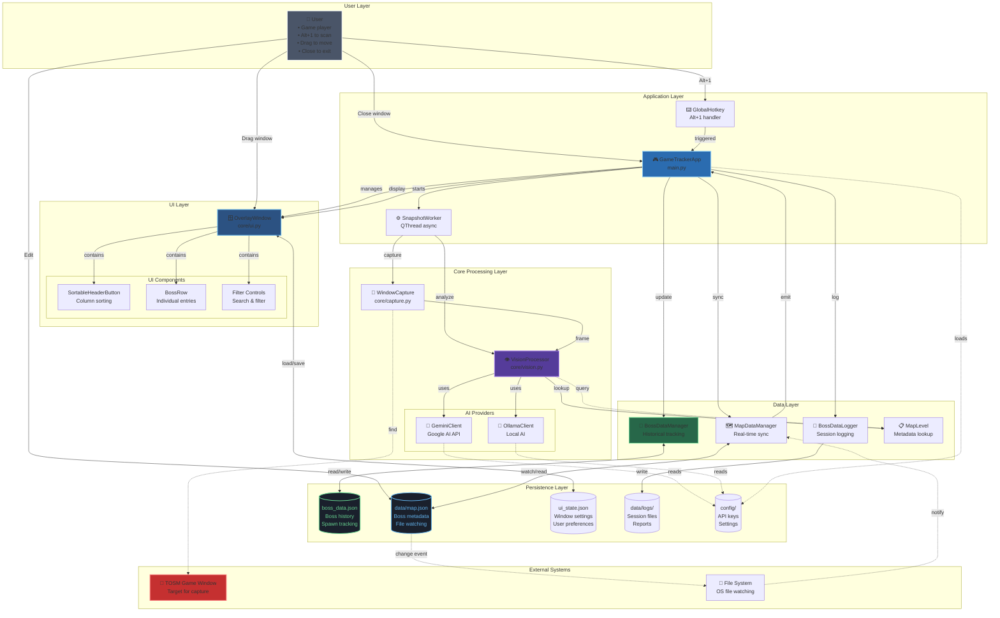

---

## Summary

This comprehensive workflow documentation covers all major aspects of the TOSM Boss Tracker application:

### Key Architectural Decisions:

1. **Async Processing**: Snapshot processing runs in a separate QThread to prevent UI freezing during AI analysis
2. **Dual AI Provider Support**: Supports both Gemini (cloud) and Ollama (local) with automatic fallback
3. **Atomic File Writes**: All JSON writes use temp-file + atomic replace pattern for data integrity
4. **File System Watching**: Real-time synchronization with external edits to map.json
5. **Global Hotkeys**: Windows API integration allows hotkeys to work even when overlay doesn't have focus
6. **Graceful Degradation**: Application continues with reduced functionality if optional components fail

### Data Flow:

1. User triggers scan (Alt+1) → Global hotkey captures event
2. Async worker captures game screen and sends to AI
3. AI extracts boss information from image
4. Results parsed and validated
5. Data persisted to JSON with atomic writes
6. UI updated with new information
7. Session logged for review

### Error Handling Strategy:

- Retry with exponential backoff for transient failures
- Fallback to alternative providers when primary fails
- Graceful degradation rather than hard crashes
- Comprehensive logging for debugging
- User notification for actionable errors
